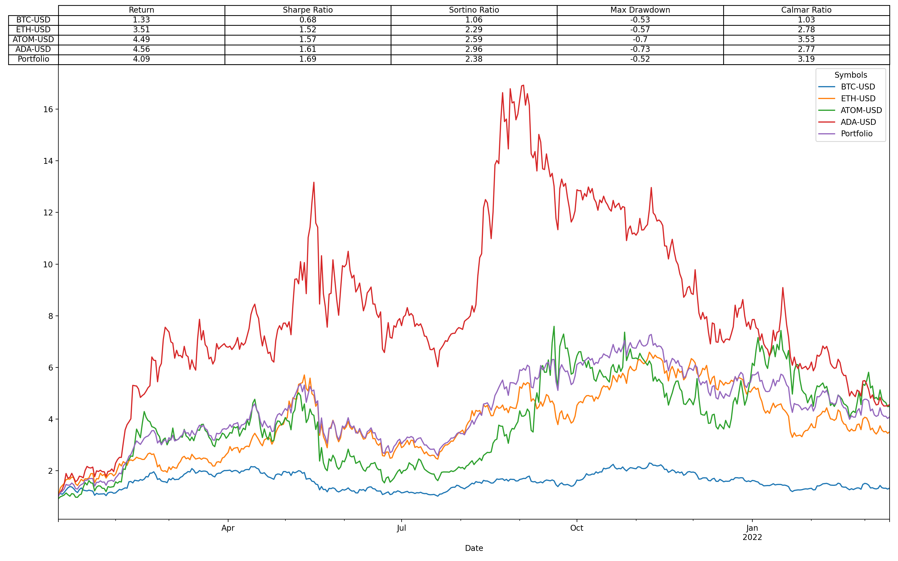

# Crypto-Portfolio-Analytics

Given a list of cryptocurrencies over a defined time period, calculate:

  total return 
  sharpe ratio 
  sortino ratio 
  max drawdown
  calmar ratio 
  
Compare performance of each cryptocurrency vs. an equally weighted portfolio. 

# Summary Table

