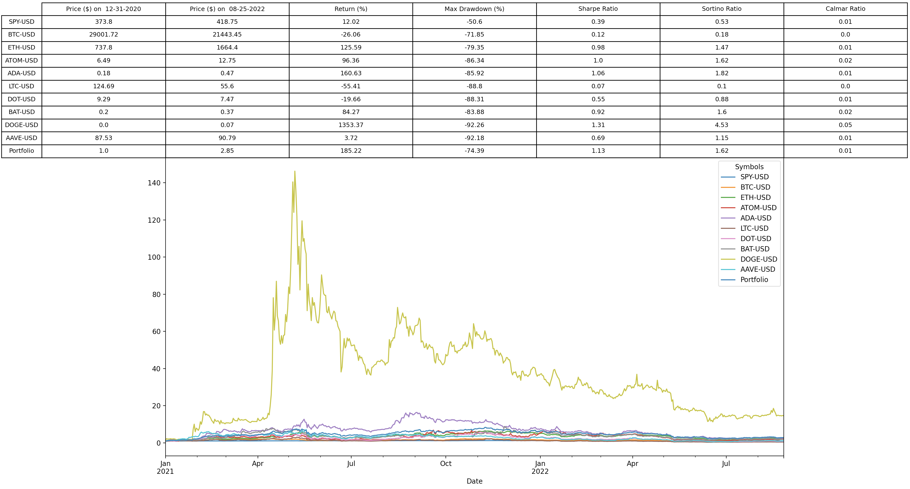
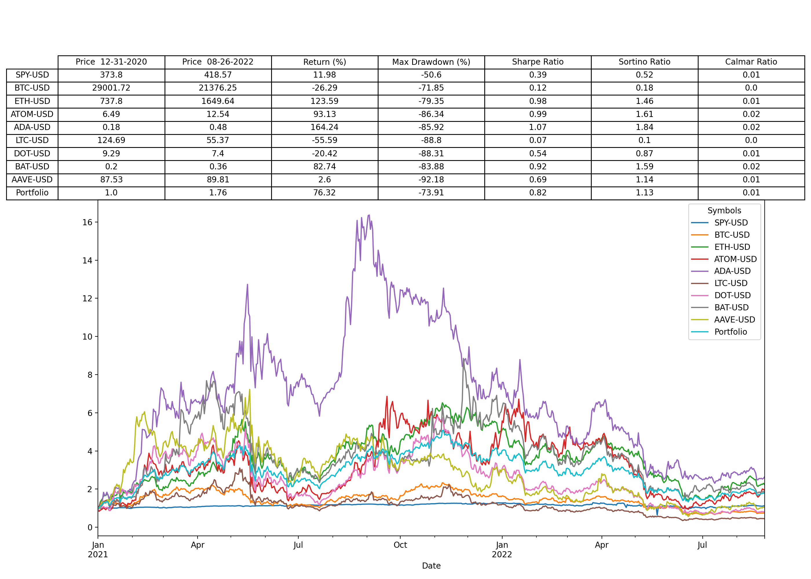

# Crypto-Portfolio-Analytics

Given a list of equities and cryptocurrencies, calculate their total return, max drawdown, sharpe ratio, sortino ratio, and calmar ratio vs. an equally weighted portfolio between December 31st 2020 and August 26th 2022. 

Notice the impact on total return from including a portion of DOGE in the portfolio (a difference of over 100% return). 

# +185% Portolio Return With DOGE

# +76% Portfolio Return Without DOGE

