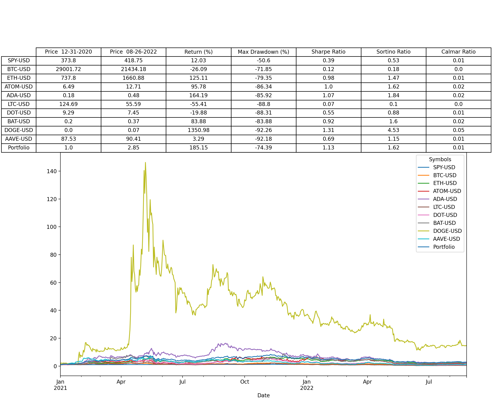

# Crypto-Portfolio-Analytics

Given a list of cryptocurrencies, calculate the total return, max drawdown, sharpe ratio, sortino ratio, and calmar ratio vs. an equally weighted portfolio between December 31st 2020 and August 25th 2022. 

Notice the impact on total return from including a portion of DOGE in the portfolio. 

# Summary

